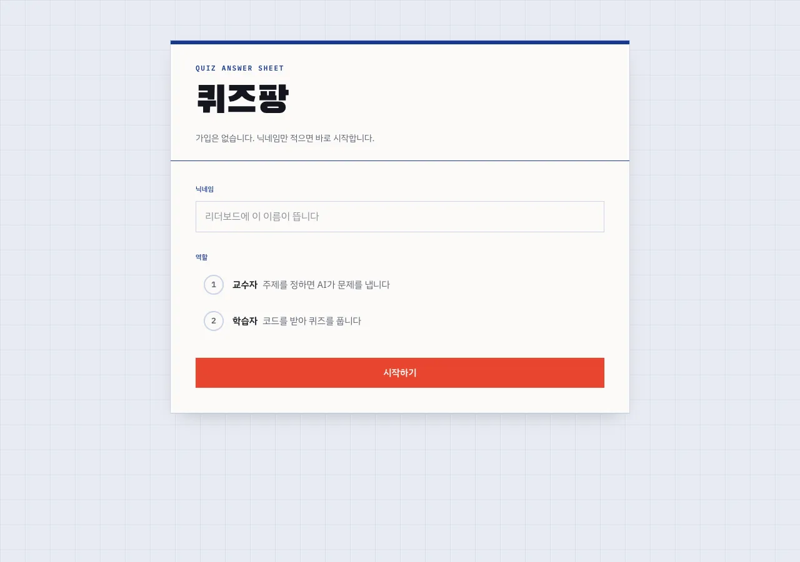
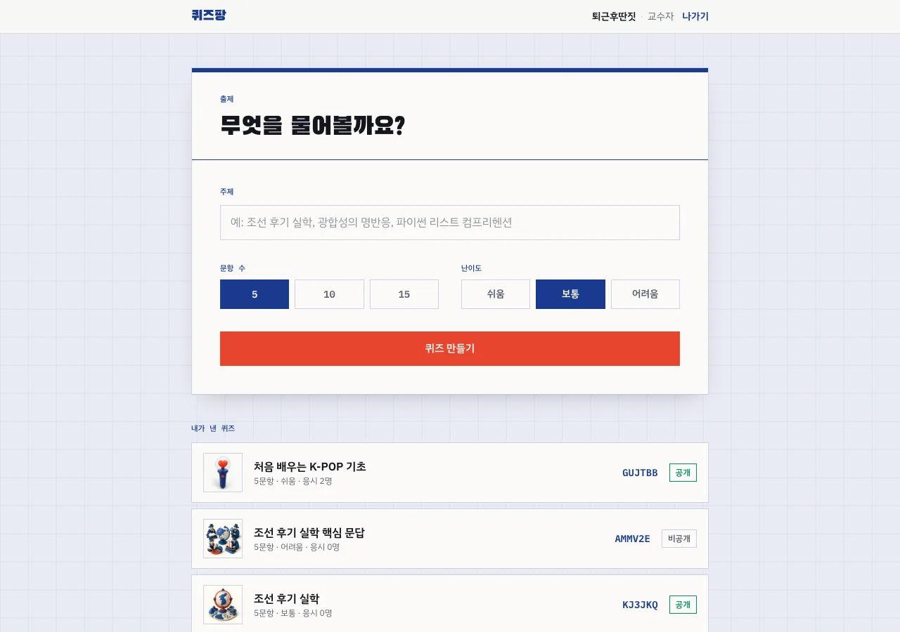
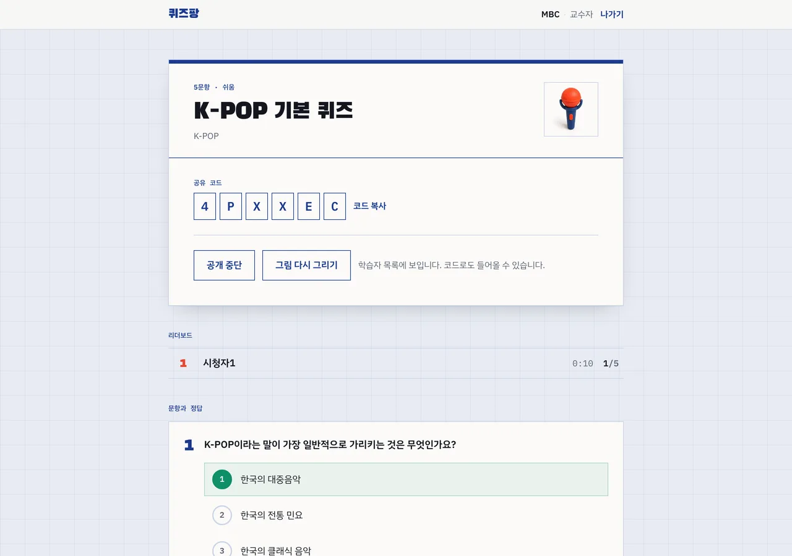
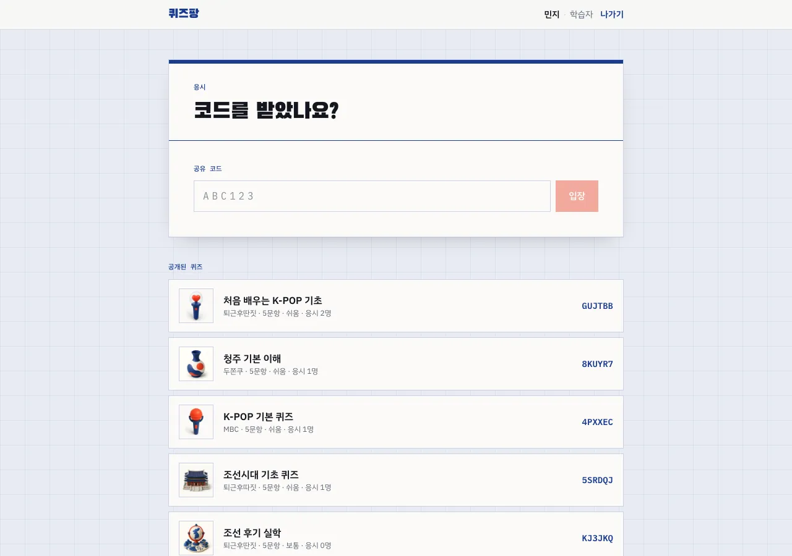
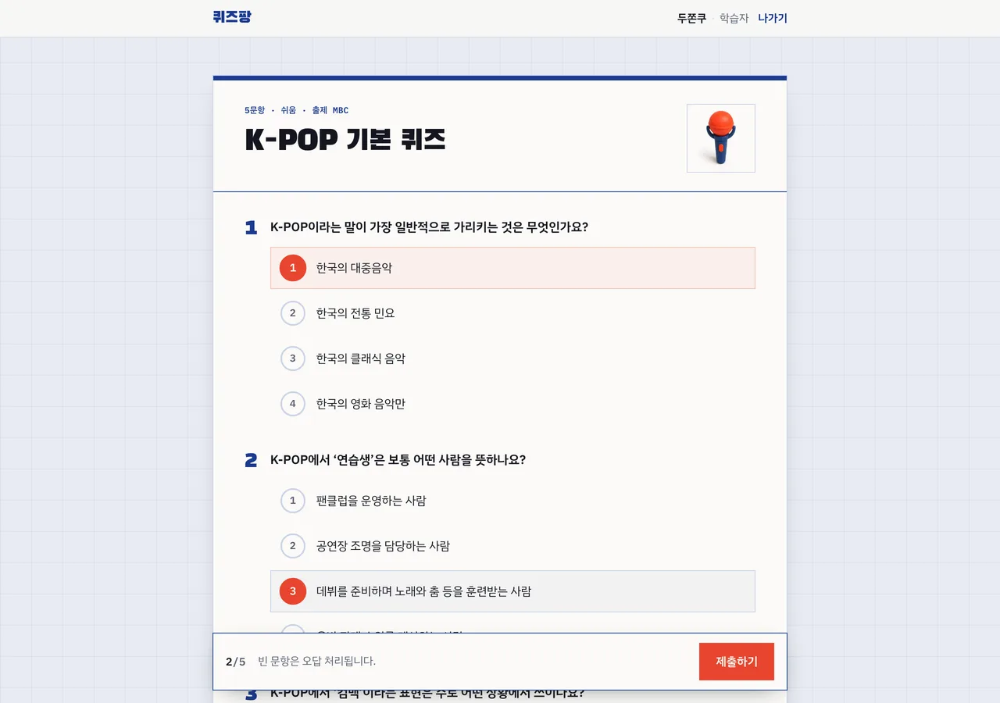
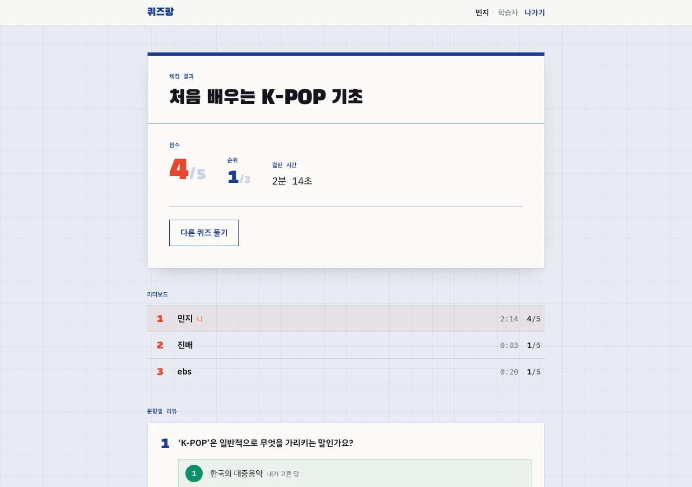
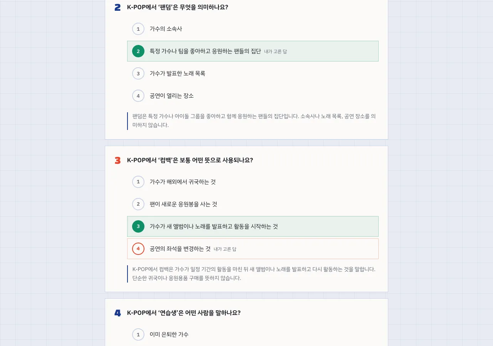

# 퀴즈팡

교수자가 주제를 적으면 AI가 문제를 내고, 학습자가 코드로 들어와 응시한 뒤 리더보드로 결과를 확인합니다.
회원가입은 없습니다. 닉네임만 적으면 들어옵니다.


<sub>45초 소개 영상을 2배속으로 줄인 미리보기입니다. 원본은 `video/` 에서 렌더링합니다 — [소개 영상](#소개-영상) 참고.</sub>

```
교수자 ──▶ 주제·문항 수·난이도 입력 ──▶ AI 출제 ──▶ 공유 코드 발급
                                                       │
학습자 ──▶ 코드 입력 ──▶ 응시 ──▶ 서버 채점 ──▶ 리더보드 ◀┘
```

## 화면

| 경로 | 하는 일 |
|------|---------|
| `/` | 닉네임 입력, 교수자·학습자 선택 |
| `/teacher` | 주제·문항 수·난이도로 퀴즈 생성, 내가 낸 퀴즈 목록 |
| `/teacher/[code]` | 공유 코드 발급, 공개 전환, 리더보드(5초마다 갱신), 문항·정답 확인 |
| `/student` | 코드 입력, 공개된 퀴즈 목록 |
| `/play/[code]` | 응시 → 채점 결과·순위·문항별 해설 |

### 들어가기 — `/`

가입 절차가 없습니다. 닉네임을 적고 역할만 고르면 바로 들어옵니다.



### 출제 — `/teacher`

주제 한 줄, 문항 수, 난이도. 이 셋이 입력의 전부입니다. 만든 퀴즈는 아래 목록에 공유 코드와 함께 쌓입니다.



### 진행 — `/teacher/[code]`

공유 코드를 크게 띄워두고 부르는 화면입니다. 리더보드는 5초마다 알아서 갱신되고, 아래로 내리면 정답과 해설을 확인할 수 있습니다.



### 입장 — `/student`

코드를 받았으면 여섯 칸에 적고, 못 받았으면 공개된 퀴즈 목록에서 고릅니다.



### 응시 — `/play/[code]`

한 화면에 전 문항이 놓입니다. 아래 바에 지금까지 고른 개수가 뜨고, 제출하면 서버가 채점해 점수·순위·문항별 해설을 돌려줍니다.



### 채점 결과 — `/play/[code]`

제출하면 같은 주소에서 결과 화면으로 바뀝니다. 점수·순위·걸린 시간이 맨 위에 뜨고, 리더보드에서 내 줄이 강조됩니다.



아래로 내리면 문항별 리뷰가 이어집니다. 정답은 초록, 내가 틀리게 고른 답은 주홍으로 표시되고 해설이 붙습니다.



## 구성

- **Next.js 16** (App Router, Turbopack)
- **Neon Postgres** — Vercel 마켓플레이스 연동. `DATABASE_URL` 자동 주입
- **OpenAI Responses API** — 구조화 출력(structured outputs)으로 스키마에 맞는 문항 JSON 을 보장
- **OpenAI Images API** — 퀴즈마다 썸네일 1장. 256×256 webp(5~7KB)로 줄여 Postgres 에 base64 로 저장한다
- **Tailwind CSS 4**

## 환경변수

| 이름 | 필요 여부 | 설명 |
|------|-----------|------|
| `DATABASE_URL` | 필수 | Neon 연동 시 자동 등록 |
| `OPENAI_API_KEY` | 필수 | 퀴즈 생성에 사용 |
| `OPENAI_MODEL` | 선택 | 문항 생성 모델. 기본 `gpt-6-astra`(문항 품질 우선). 비용을 줄이려면 `gpt-5.6-luna` |
| `OPENAI_IMAGE_MODEL` | 선택 | 썸네일 모델. 기본 `gpt-image-2`. 더 싸게 가려면 `gpt-image-1-mini` |
| `QUIZ_IMAGE_STYLE` | 선택 | 기본 3D 클레이 렌더. `flat` 으로 두면 평면 일러스트 |

```bash
vercel env add OPENAI_API_KEY          # Vercel 에 등록
vercel env pull .env.local --yes       # 로컬로 내려받기
```

## 실행

```bash
npm install
vercel env pull .env.local --yes
npm run db:init      # db/schema.sql 을 Neon 에 적용 (한 번만)
npm run dev
```

| 스크립트 | 하는 일 |
|----------|---------|
| `npm run dev` | 개발 서버 |
| `npm run build` / `npm start` | 프로덕션 빌드·실행 |
| `npm run lint` | ESLint |
| `npm run db:init` | `db/schema.sql` 적용. 전부 `if not exists` 라 여러 번 돌려도 안전하다 |

배포는 Vercel 에 그대로 올리면 됩니다. 퀴즈 생성과 썸네일 생성 라우트는 모델 응답을 기다리므로 `maxDuration = 300` 으로 잡아두었습니다.

## 소개 영상

`video/` 는 [Remotion](https://www.remotion.dev) 으로 만든 45초 소개 영상입니다. 앱과 같은 팔레트·서체로 화면을 컴포넌트로 다시 그렸고, 문항은 실제 퀴즈 "처음 배우는 K-POP 기초"(`video/src/data/quiz.json`)를 씁니다. Next 앱과는 패키지가 분리되어 있어 배포 빌드에 영향이 없습니다.

| 장면 | 시간 | 내용 |
|------|------|------|
| 오프닝 | 0–5초 | 답안지가 내려오고 버블이 칠해지며 로고 |
| 출제 | 5–14초 | 주제 타이핑 → 난이도 선택 → AI 출제 |
| 공유 코드 | 14–20초 | 여섯 자리 코드가 한 칸씩 찍힘 |
| 응시 | 20–29초 | 문항을 마킹하고 제출 |
| 결과 | 29–38초 | 점수·순위·리더보드 → 문항별 해설 |
| 엔딩 | 38–45초 | 핵심 기능 3줄과 저장소 주소 |

```bash
cd video
npm install
npm run studio   # 브라우저에서 미리보기·수정
npm run render   # out/quizpang-intro.mp4 (1920×1080, 30fps)
```

렌더링 결과(`video/out/`)는 용량 때문에 커밋하지 않습니다.

## API

| 메서드 | 경로 | 하는 일 |
|--------|------|---------|
| `GET` | `/api/quizzes?author=<닉네임>` | 공개된 퀴즈 목록. `author` 를 주면 그 사람이 낸 비공개 퀴즈까지 |
| `POST` | `/api/quizzes/generate` | 주제·문항 수·난이도로 출제 후 저장, 공유 코드 반환 |
| `GET` | `/api/quizzes/:code?author=<닉네임>` | 퀴즈 1건과 문항. 작성자가 아니면 `answer`·`explanation` 이 빠진다 |
| `PATCH` | `/api/quizzes/:code` | 공개 여부 전환 (작성자만) |
| `DELETE` | `/api/quizzes/:code?author=<닉네임>` | 삭제 (작성자만) |
| `GET` | `/api/quizzes/:code/attempts` | 리더보드 |
| `POST` | `/api/quizzes/:code/attempts` | 답안 제출 → 서버 채점 → 결과·순위 반환 |
| `GET` | `/api/quizzes/:code/thumbnail?v=<갱신시각>` | 썸네일 webp |
| `POST` | `/api/quizzes/:code/thumbnail` | 썸네일 다시 그리기 (작성자만) |

## 데이터 모델

| 테이블 | 담는 것 |
|--------|---------|
| `quizzes` | 코드·제목·주제·난이도·작성자·공개 여부, 썸네일(base64)과 갱신 시각 |
| `questions` | 퀴즈별 문항. 본문, 선택지 4개(`jsonb`), 정답 인덱스, 해설 |
| `attempts` | 응시 기록. 닉네임·점수·소요 시간·제출한 답안 |

공유 코드는 6자리이고 헷갈리는 글자(`0/O`, `1/I/L`)를 뺀 알파벳에서 뽑습니다 (`src/lib/code.ts`) — 수업에서 소리 내어 불러주기 위한 선택입니다.

## 설계 메모

- **채점은 전적으로 서버에서** 합니다. 학습자에게 내려가는 문항 JSON 에는 `answer` 와 `explanation` 이 없습니다 (`src/app/api/quizzes/[code]/route.ts`).
- **리더보드는 닉네임당 최고 기록 1건**만 올립니다. 동점이면 더 빨리 푼 사람이, 그마저 같으면 먼저 푼 사람이 위로 갑니다.
- **비공개 퀴즈**는 작성자 본인만 조회·응시할 수 있습니다. 공개 전환도 작성자만 가능합니다.
- **모델이 뱉은 문항은 저장 전에 한 번 거릅니다.** 선택지가 4개가 아니거나 정답 인덱스가 0~3 밖이면 버리고, 역슬래시로 이스케이프된 줄바꿈도 여기서 풀어줍니다 (`src/lib/generate.ts`).
- **썸네일은 문항을 저장한 뒤에** 만듭니다. 이미지 생성이 실패해도 퀴즈는 그대로 남고, 목록에는 빈 버블이 대신 뜹니다. 교수자 화면의 "그림 만들기" 로 나중에 채울 수 있습니다.
- 썸네일 URL 에는 `?v=<갱신시각>` 이 붙습니다. 다시 그리면 주소가 바뀌므로 이미지에 1년 `immutable` 캐시를 걸어도 안전합니다.
- 이미지는 별도 스토리지 없이 Postgres 에 넣습니다. 장당 5~7KB 라 무료 플랜에서 문제되지 않고, 목록 API 에는 실리지 않습니다(`/api/quizzes/:code/thumbnail` 로 따로 받습니다).
- **이미지 프롬프트에 글자를 넣지 말라고 못박아 두었습니다.** 이미지 모델이 한글을 제대로 못 쓰기 때문입니다. 색도 앱 팔레트(미색 종이·남색·주홍)로 묶어 답안지 화면 위에서 겉돌지 않게 했습니다.
- 닉네임은 브라우저 `localStorage` 에만 있습니다. 비밀번호가 없으므로 같은 닉네임을 쓰면 같은 사람으로 취급됩니다 — 교실용 전제입니다.
